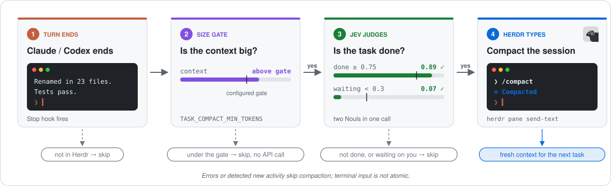
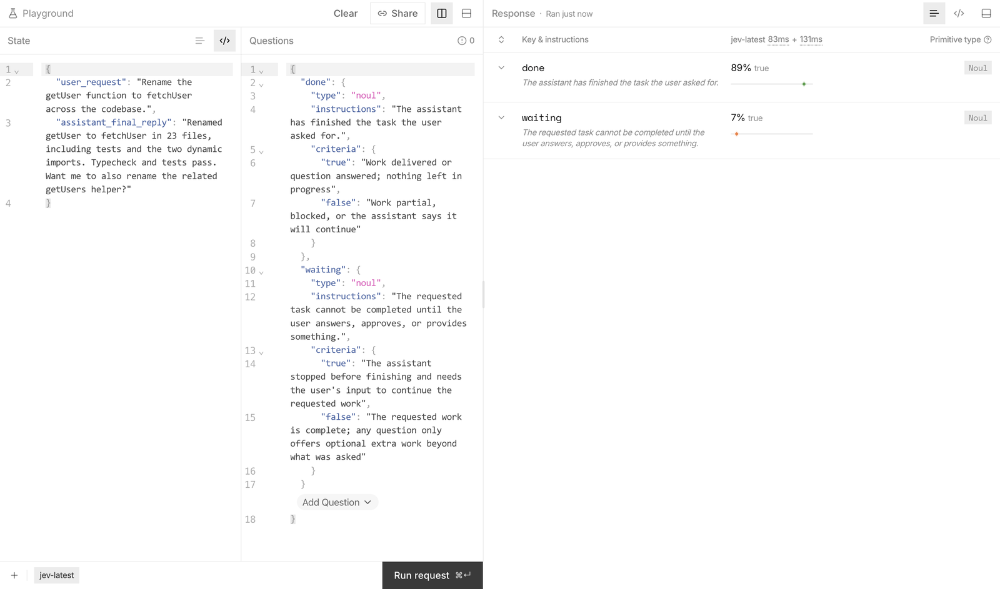
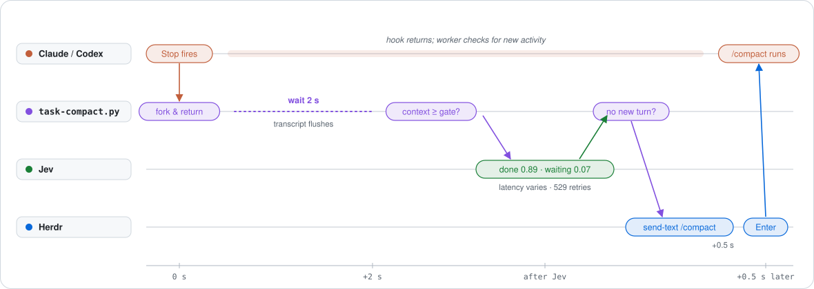

# Herdr + Jev: auto-compaction for Claude Code and Codex CLI

[](LICENSE)
[](https://www.python.org)
[](#installation)
[](claude/README.md)
[](codex/README.md)

Compact **Claude Code or Codex CLI when a task finishes** inside a Herdr pane.
Once context passes a configurable token gate, TypeSafe's Jev judges the latest
request and final reply. If the work is done and isn't waiting for your input,
the hook asks Herdr to type `/compact` into the agent's terminal.

Each agent has a standalone Python implementation using only the standard library.
Built-in auto-compaction remains the backstop for tasks that run long.

<picture>
  <source media="(prefers-color-scheme: dark)" srcset="assets/flow-dark.svg">
  
</picture>

## Contents

- [Why compact at task boundaries](#why-compact-at-task-boundaries)
- [Herdr and Jev](#herdr-and-jev)
- [How it works](#how-it-works)
- [Installation](#installation)
- [Configuration](#configuration)
- [Tuning the judge](#tuning-the-judge)
- [Verification and troubleshooting](#verification-and-troubleshooting)
- [Privacy](#privacy)
- [Limitations](#limitations)
- [Repository layout](#repository-layout)
- [Uninstall](#uninstall)

## Why compact at task boundaries

Long sessions accumulate old requests, file contents, tool output, and reasoning.
Compacting after a finished task aims to reduce that accumulated context before
starting the next task, while preserving the working detail during an unfinished one.
The result depends on the agent, model, and task; this is a timing heuristic,
not a guarantee of better quality or lower cost.

Both implementations use the same completion questions and leave the agent's
built-in compaction settings alone. Their default token gates differ and should
be tuned for the model you run.

## Herdr and Jev

### Herdr: submitting the command

[Herdr](https://herdr.dev) supplies `HERDR_PANE_ID` to the agent's terminal.
Both scripts use `herdr pane send-text` and `herdr pane send-keys` to submit
`/compact` to that pane. Without the pane variable, the hooks do nothing.

The diagrams include the Herdr logo from [herdrdev/herdr](https://github.com/herdrdev/herdr)
(Apache-2.0).

### Jev: judging completion

Both scripts call TypeSafe's Jev with two probability-valued questions, called
Nouls in the existing implementation. Jev sees the latest request and the agent's
final reply, rather than the whole conversation.

| Question | Meaning | Required score |
|---|---|---|
| `done` | The requested work is delivered or the question answered. | ≥ 0.75 |
| `waiting` | The requested work needs the user's answer, approval, or input to finish. | < 0.3 |



The screenshot illustrates the shared questions with a finished task that offers
optional extra work. It is a judge example, not an end-to-end test of either agent.

## How it works

<picture>
  <source media="(prefers-color-scheme: dark)" srcset="assets/timeline-dark.svg">
  
</picture>

1. The agent's `Stop` hook launches a detached worker and returns.
2. After a two-second delay, the worker verifies the completed turn and context size.
3. If the context meets the gate, Jev judges completion. HTTP 529 responses retry twice.
4. If both scores pass, the worker checks for new activity and types `/compact`.
5. After another 0.5 seconds, it checks again before pressing Enter.

The timeline is schematic; API latency and transcript flushing vary. The scripts
skip compaction when required data is missing, validation fails, or an error occurs.

| Detail | Claude Code | Codex CLI |
|---|---|---|
| Request source | Latest human prompt found in the Claude transcript | Prompt captured by `UserPromptSubmit` |
| Completion check | Transcript reply matches the Stop reply | Matching turn start, completion, and final reply in the rollout |
| Context size | Input + cache-read + cache-creation tokens | Latest input tokens; cached input is already included |
| Activity checks | Transcript entries and file size | Prompt generation and rollout fingerprint |
| Additional guards | `stop_hook_active` | `stop_hook_active`, per-pane worker lock, duplicate suppression, lifecycle cancellation |
| Default token gate | 600,000 (60% of Opus 5.5’s 1M window) | 630,000 (60% of Astra’s 1.05M window) |

See the [Codex lifecycle details](codex/README.md#how-it-works) for prompt capture,
rollout verification, and cancellation events.

## Installation

Both versions require Python 3.8+, Herdr, and a TypeSafe API key. The Codex version
uses a Unix file lock and targets macOS/Linux. Run the chosen agent interactively
inside a Herdr pane.

Follow the agent-specific guide for the complete registration and verification steps:

| Agent | Guide | Hook configuration |
|---|---|---|
| Claude Code | [Claude setup](claude/README.md) | [settings.example.json](claude/settings.example.json) → `~/.claude/settings.json` |
| Codex CLI | [Codex setup](codex/README.md) | [hooks.example.json](codex/hooks.example.json) → `${CODEX_HOME:-~/.codex}/hooks.json` |

From the repository root, copy the implementation you want:

```sh
# Claude Code
mkdir -p ~/.claude/hooks
cp claude/task-compact.py ~/.claude/hooks/task-compact.py

# Codex CLI
mkdir -p "${CODEX_HOME:-$HOME/.codex}/hooks"
cp codex/task-compact.py "${CODEX_HOME:-$HOME/.codex}/hooks/task-compact.py"
```

Copying the script alone does not register it. Merge the corresponding example
into the agent's configuration, preserving existing hooks. For Codex, follow its
hook trust flow as described in the setup guide. Install each integration once.

## Configuration

| Variable | Claude Code | Codex CLI |
|---|---|---|
| `TASK_COMPACT_MIN_TOKENS` | Default `600000` | Default `630000` |
| `TASK_COMPACT_DRY` | Any nonempty value prevents injection; use `1` | Exactly `1` prevents injection |
| `TYPESAFE_API_KEY` | Environment variable or macOS Keychain fallback | Same |
| `CODEX_HOME` | Not used | Overrides the default `~/.codex` location |

Claude can receive these environment variables through the `env` block of its
settings file. For Codex, set them in the environment that launches the CLI.
Both use the macOS Keychain service `typesafe-api-key` under your login account
when `TYPESAFE_API_KEY` is absent.

The defaults are fixed token counts: 60% of Opus 5.5’s 1M window and Astra’s
1.05M window. They do not automatically scale to the active session window.
For a smaller window, set `TASK_COMPACT_MIN_TOKENS` to 60% of that window and
keep the agent’s built-in compaction threshold above the task gate. These are
starting heuristics, not measured optima; see the [threshold research](docs/research/compaction-thresholds.md).
Dry mode still calls Jev and sends the request/reply excerpts.

## Tuning the judge

Both scripts define `QUESTIONS`, `DONE_MIN`, and `WAITING_MAX`. They are separate
standalone files; edit both if you want the same change for both agents.

These historical examples came from the original project's Jev Playground runs
with `jev-1.13.0`. They illustrate the shared criteria, not Codex-specific validation:

| Case | done | waiting | Compacts? |
|---|---|---|---|
| Finished | 0.90 | 0.03 | ✅ |
| Answered a question | 0.97 | 0.02 | ✅ |
| Done, offers optional extra work | 0.89 | 0.06 | ✅ |
| Asks a question before finishing | 0.08 | 0.90 | ❌ |
| Blocked on an error | 0.05 | 0.96 | ❌ |
| Partial, "next I'll…" | 0.02 | 0.31 | ❌ |

The `waiting` criteria say explicitly that offering optional extra work ("Want me to also…?") doesn't count as waiting.
Without that, finished replies that ended with an offer scored 0.80 and never compacted.

To try your own cases, open the Playground in the [TypeSafe console](https://console.typesafe.ai). Paste the
`QUESTIONS` dict from the script as the questions, and use JSON state like this:

```json
{
  "user_request": "Rename the getUser function to fetchUser across the codebase.",
  "assistant_final_reply": "Renamed getUser to fetchUser in 23 files. Typecheck and tests pass. Want me to also rename getUsers?"
}
```

## Verification and troubleshooting

Run both offline suites from the repository root:

```sh
python3 claude/test_task_compact.py
python3 codex/test_task_compact.py
```

The Claude suite and all 16 Codex tests pass. The Codex parser was also checked
against three completed local rollout turns. A [live smoke test](docs/testing/codex-jev-smoke.md)
verified both a Jev dry run and actual Herdr-triggered Codex compaction.
The Codex guide includes the dry-run procedure for verifying your own installation.

| Agent | Decision log |
|---|---|
| Claude Code | `~/.claude/state/task-compact.log` |
| Codex CLI | `${CODEX_HOME:-~/.codex}/state/task-compact/decisions.jsonl` |

No log usually means the agent is outside Herdr or the hooks are not registered
(and trusted, for Codex). `small` means the gate prevented a Jev call.
`new-turn` means detected activity canceled injection. `new-turn-typed` means
`/compact` may have been typed but not submitted; remove it from the input box.
See the individual guides for agent-specific skip reasons and errors.

## Privacy

Above the token gate, both implementations send up to 4,000 characters of the
latest request and 8,000 characters of the final reply to `api.typesafe.ai`.
This includes dry runs. Global installation applies to every project where that
agent runs inside Herdr with the hooks enabled.

The Codex implementation also stores the latest prompt excerpt in a local file
with mode `0600`; lifecycle invalidation removes it. Decision logs persist for
both agents. Keep API keys out of the repository.

## Limitations

- **Herdr terminal sessions only.** These integrations submit terminal input; the
  Codex implementation does not control the desktop app, IDE, cloud, or `codex exec`.
- **One request/reply pair.** The judge can miss unfinished work spanning several
  requests, active goals, or outstanding background tasks.
- **Terminal races remain.** Submitted activity can cancel injection, but text you
  have typed without submitting is invisible to these checks. Input checks and
  keypresses are not atomic.
- **Timing and transcript formats can vary.** The two-second settling delay can
  miss a slow flush. Agent-specific parsers skip unsupported or incomplete data.
- **A probabilistic decision.** Jev can misjudge completion. Use dry mode and tune
  the gate and questions against your own sessions.

## Repository layout

- `claude/`: Claude-specific hook, configuration example, tests, and setup guide.
- `codex/`: Codex-specific hook, configuration example, tests, and setup guide.
- `assets/`: shared diagrams and the Jev Playground screenshot.
- `LICENSE`: shared MIT license.

## Uninstall

Remove this integration's hook entries from the relevant agent configuration.
Then follow the [Claude uninstall steps](claude/README.md#uninstall) or
[Codex uninstall steps](codex/README.md#privacy-and-uninstall) to remove its script
and state. Preserve unrelated hooks. Detached workers may finish briefly after removal.

[MIT](LICENSE)
